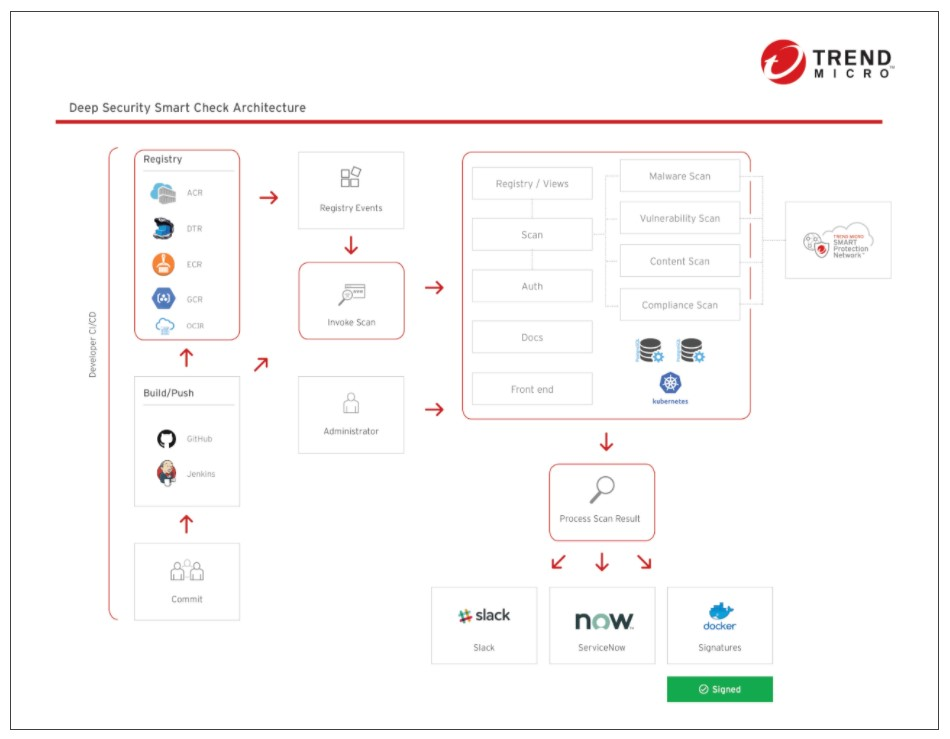
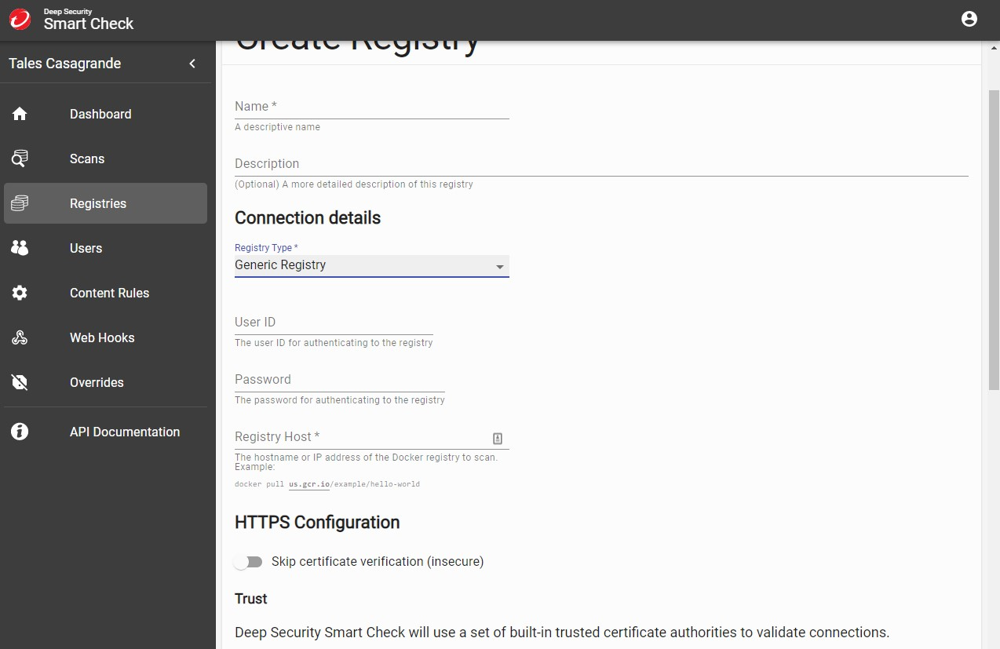

# DSSC-OracleContainerRegistry
Integração do Smart Check com o Container Registry da Oracle para scan de imagens.

Com o Smart Check é possivel realizar  varreduras antes de execução de imagens Docker, permitindo que você corrija os problemas antes que eles atinjam o ambiente de produção.

O Deep Security Smart Check oferece a capacidade de:

* detectar vulnerabilidades no nível do sistema operacional e no nível do aplicativo,
* detectar malware
* detectar segredos e chaves incorporadas em seus aplicativos
* realizar consultas de varredura personalizadas para encontrar arquivos suspeitos ou indesejados
* verificar o conteúdo da imagem em uma lista de verificação de conformidade que inclui itens do PCI -DSS, HIPAA e NIST 800-190.

# Pré-requisitos

* Oracle Cloud https://www.oracle.com/br/cloud/free/
* Cloud One http://cloudone.trendmicro.com/
* Licença para o Smart Check https://www.trendmicro.com/product_trials/download/index/us/168

# Topologia

 </img>

# Adicionando um Registry no Smart Check

Na console do Oracle Cloud navegue até o menu Identity > Users > Details > Resources > Auth Tokens > Generate Token

O token gerado para efetuar login no registry via linha e comando e também é utilizaremos no Smart Check.

Em Administration > Tenancy Details > Home Region indentificamos a região onde estamos.
Verifique o id da região na documentação, utilizaremos ela para login.
<p>
https://docs.oracle.com/en-us/iaas/Content/Registry/Concepts/registryprerequisites.htm#regional-availability
<p>
https://docs.oracle.com/en-us/iaas/Content/Registry/Tasks/registrypushingimagesusingthedockercli.htm
  
Nesse exemplo usaremos São Paulo:

```
$ docker login https://sa-saopaulo-1.ocir.io
username: <tenancy-namespace>/oracleidentitycloudservice/<username>
password: inserir-token
Login Succeeded
```

Conseguimos autenticar no Registry, usaremos as mesmas credenciais no Smart Check.

 </img>

Name: Defina um Nome
<p>
Registry Type: Generic Registry
<p>
User ID: <tenancy-namespace>/oracleidentitycloudservice/<username>
<p>
Password: Colar o Token
<p>
Caso você tiver um certificado PEM siga as recomendações.
